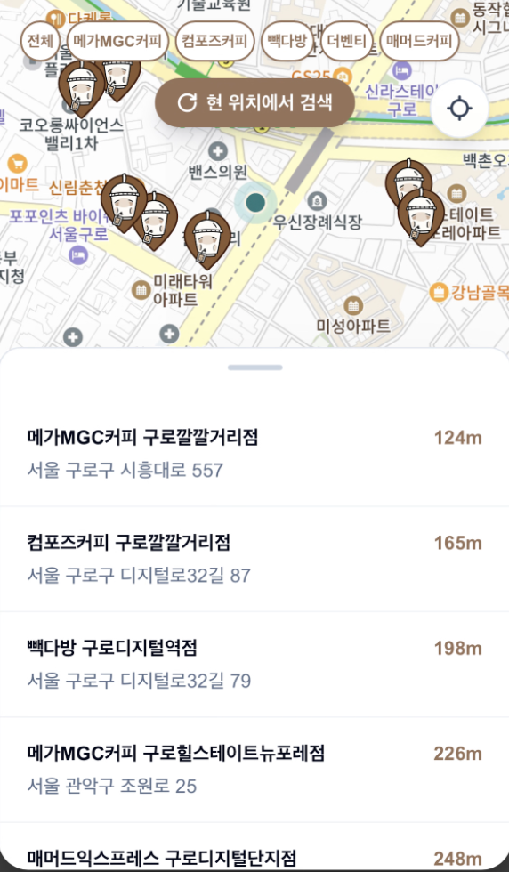
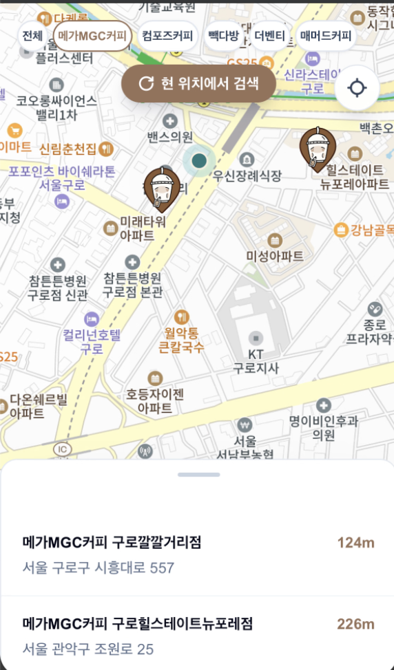
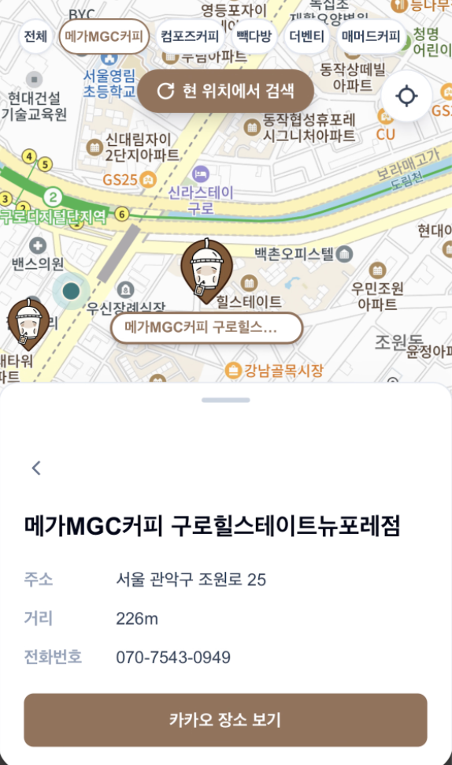

<p align="center">
  
</p>

<h1 align="center">Coffit</h1>

<p align="center">
  너무 피곤해서 내 커피마저 커피가 필요할 지경이라면?<br />
  내 주변 저가 커피 프랜차이즈를 Coffit에서 찾아보세요!
</p>

## 소개

Coffit은 현재 위치를 기준으로 저가 커피 프랜차이즈 매장을 지도와 거리순 목록으로 보여주는 서비스입니다.
메가MGC커피, 컴포즈커피, 빽다방, 더벤티, 매머드커피 중 원하는 브랜드만 골라 빠르게 확인할 수 있습니다.

## 주요 기능

### 주변 저가 카페 탐색

현재 위치 주변의 매장을 지도 마커와 거리순 목록으로 한눈에 확인할 수 있습니다.

<p align="center">
  
</p>

### 브랜드별 매장 필터링

원하는 브랜드만 선택하면 지도 마커와 매장 목록을 함께 좁혀볼 수 있습니다.

<p align="center">
  
</p>

### 매장 상세 정보 확인

매장을 선택하면 주소, 거리, 전화번호를 확인하고 카카오맵 장소 페이지로 이동할 수 있습니다.

<p align="center">
  
</p>

## 기술 스택

| 영역             | 기술                                           |
| ---------------- | ---------------------------------------------- |
| Web              | Next.js 16, React 19, TypeScript, Tailwind CSS |
| API              | NestJS, TypeScript, Swagger                    |
| 지도·장소 데이터 | Kakao Maps SDK, Kakao Local API                |
| 패키지 관리      | pnpm workspace                                 |

## 프로젝트 구조

```text
coffit/
├── apps/
│   ├── web/                  # Next.js 기반 지도 웹 애플리케이션
│   │   └── src/
│   │       ├── app/          # 페이지와 전역 스타일
│   │       ├── features/map/ # 지도, 카페 탐색 기능
│   │       └── shared/       # 공통 API, 위치, UI
│   │
│   └── api/                  # NestJS 기반 카페 검색 API
│       └── src/
│           ├── cafes/        # 카페 검색, 브랜드 판별·카카오 API 연동
│           └── health/       # 헬스 체크
│
└── docs/
    ├── ai/                   # AI 협업 workflow와 개발 규칙
    └── images/               # 이미지

---
```
